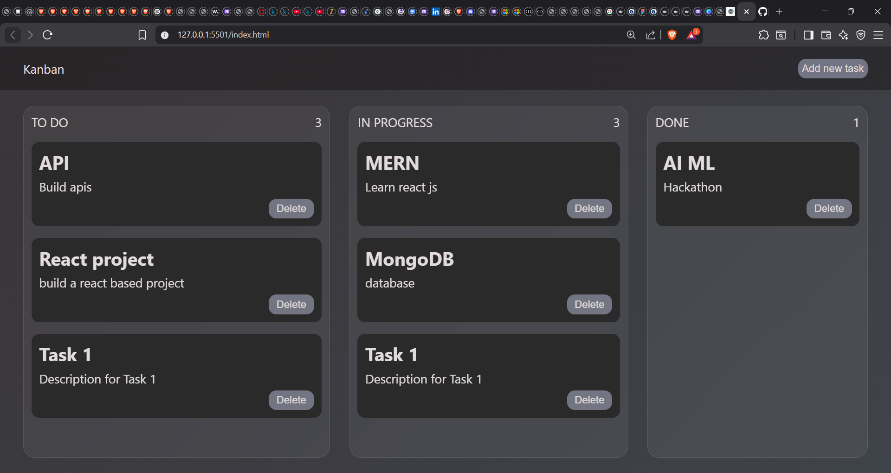

# KANBAN-BOARD-USING-JAVASCRIPT
🗂️ Kanban Board – Drag & Drop Task Manager

A minimal, interactive Kanban Board built using HTML, CSS, and Vanilla JavaScript that helps users organize tasks across different stages of progress using drag-and-drop functionality. Tasks are persisted using localStorage, ensuring data remains intact even after page reloads.

🚀 Features

📌 Create Tasks with title and description

🖱️ Drag & Drop tasks between columns (To Do, In Progress, Done)

🔢 Live Task Count per column

💾 Persistent Storage using localStorage

🧩 Dynamic UI Updates without page reload

🎨 Modern Glassmorphism UI

⚡ Fully built with Vanilla JavaScript (No frameworks)

🛠️ Tech Stack

HTML5 – Structure

CSS3 – Styling, animations, glassmorphism effects

JavaScript (ES6) – Logic, drag & drop, state management

Browser localStorage – Data persistence

📂 Project Structure
kanban-board/
│
├── index.html        # Main HTML structure
├── style.css         # Styling and UI effects
├── script.js         # Application logic
└── README.md         # Project documentation

🧠 How It Works

Tasks are created through a modal form.

Each task is draggable across columns.

Drag events update the UI and task state.

Task data is saved to localStorage after every change.

On page reload, tasks are restored automatically.

📸 Preview

🧪 Future Enhancements

🗑️ Delete task functionality

✏️ Edit task details

📱 Mobile touch drag support

🆔 Unique task IDs

☁️ Backend / Database integration

🌙 Dark–Light mode toggle

🙋‍♀️ Author

Tasneem Raza
Computer Science Student | Web Development & AI Enthusiast

🔗 LinkedIn: https://www.linkedin.com/in/tasneem-raza-275b572b7/

💻 GitHub: https://github.com/Tasneem-netcode

⭐ If you like this project

Give it a star ⭐ and feel free to fork or contribute!